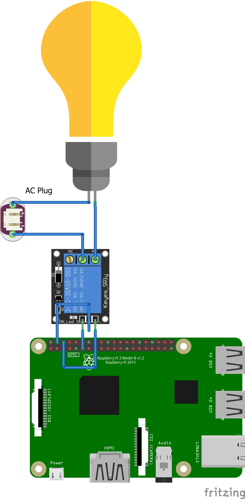

# Project FlexiLuminos
# Team IdeaFleet

## Problem Statement:
These days, it is seen that due to the advent of various IoT enables smart switches, majority of people who are not well accustomed to the latest technology are seen to have much difficulty controlling. Our project, FlexiLuminos is aimed at solving this problem by making a platform independent Smart Switch.
Moreover, it solves a few drawbacks of traditional switches:<br>
	•General switches have the risk of electrification.<br>
	•Difficult to control from all corners of the home.<br>
	•IoT enabled switches and smart plugs are quite expensive.<br>
	•Most people from older generation are not comfortable with controlling lights and fans from mobile apps.<br>
## Features of FlexiLuminos:
	•The switch can be accessed directly from Web Browser.<br>
	•The earlier point implies that it is platform independent.  Any internet enabled device can be used.<br>
	•A minimal android app for faster control. <br>
	•Control from Social media too. Yes, your family members and you can control the living room AC and the dining room fan from the family Telegram group or Discord Server.<br>
	•There is no centralized global server. Hence, the user can rely on us for privacy. Zero data logging on our servers. All data processing will be done on a small control unit kept in the user’s home.<br>
	•Remote trouble-shooting option will be present if the device malfunctions.<br>
	•Ever wanted to turn on the air-conditioner before reaching home just to find your room cooled down? FlexiLuminos guarantees this even with any non-IoT enabled Air Conditioner. Remote switch feature available for all connected appliances.<br>
	•The switches are as thin as a piece of paper, in fact, it is paper. QR Code to be specific, and can easily be moved from one place to another because it is paper itself. Ever thought how good it would have been if you could photocopy switches? Photocopy the switch of the hall light and keep it in the bedroom. No need of fumbling for the switch in the middle of the night in darkness.<br>
    •No more complex wiring for Staircase using Two Way switches. Just keep the QR Codes instead.

## Programming Frameworks:
•	Java Networking <br>
•	GPIO Library, Python<br>
•	Discord bot library, Python<br>
•	Telegram bot library, Python<br>
•	IFTTT.com<br>
•	Node.js LocalTunnel<br>
•	Apache Server<br>
•	Flutter<br>
•	Raspberry-pi (Raspbian Buster)<br>
•   FrontEnd Web Dev

## Installation Instruction

Setup the Circuit shown in ```./Circuit/Circuit.jpg```<br>


Open Terminal or SSH to your RPi running Raspbian Buster.<br>
Enter the following.
```
git clone https://github.com/AdityaMitra5102/FlexiLuminos.git
cd FlexiLuminos/RPiCode
sudo chmod +x installer.sh
sudo ./installer.sh
```
Compile the android app using Flutter.

Import the home screen widgets using KWGT.

The QR Code Switches are as ```./QR Codes/Switch_on.png``` and ```./QR Codes/Switch_off.png``` respectively.<br><br>

Setup the IFTTT Applets in ```ifttt.com``` as in the ```./IFTTT Applets/Applets.pdf```<br>

## Discord Link
```
https://discord.gg/PG2Web7SZv
```
<br>

## Telegram Link
```
https://t.me/joinchat/Jdbo8FCLEA8OXtj08YualA
```

## Web Link
```
https://flexiluminosserver.loca.lt
```

### The FlexiLuminos Project is ready to run now.

## FlexiLuminos can now be controlled from
• Web Browser <br>
• Android App <br>
• Home Screen Widgets <br>
• Google Home <br>
• Google Assistant <br>
• Amazon Alexa <br>
• Amazon Echo <br>
• Telegram <br>
• Discord <br>
• QR Codes <br>
• Your Custom application by adding our Web-hooks <br>

## YouTube Video Link
```
https://youtu.be/0A87cyhWnKA
```
Please watch in HD because the text will be blurry otherwise.
[](https://youtu.be/0A87cyhWnKA)
